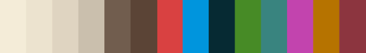
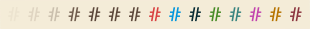
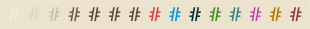
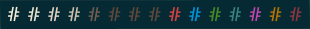

# base16-sepia
Base16-sepia is a color scheme based on the sepia palette for Firefox's reading
mode.

I wanted the palette to be as close to the original as possible, however
Firefox's palette defines only a few colors. This scheme is a compromise, I
used the original colors, except for a small change in the foreground color,
and added colors I felt were a good fit.

__NOTE__: This is a personal project and a work in progress! Colors may change
as I do some more testing. Also, this is a light scheme, which some people may
not enjoy. If you want to, give it a try :metal:.

# Samples

### Palette

### Background colors

| Background Color | Sample                |
| :--------------: | :-------------------: |
| base00           |  |
| base01           |  |
| base02           |  |
| base03           |  |
| base0a           |  |

# Misc

If you enjoy light color schemes and mine just does not make the cut, check
Ethan Schoonover's [Solarized](https://ethanschoonover.com/solarized) and
Nikyle Nguyen's [PaperColor](https://github.com/NLKNguyen/papercolor-theme) out!
